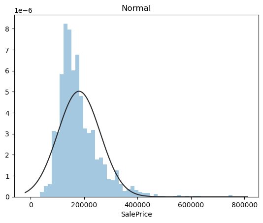
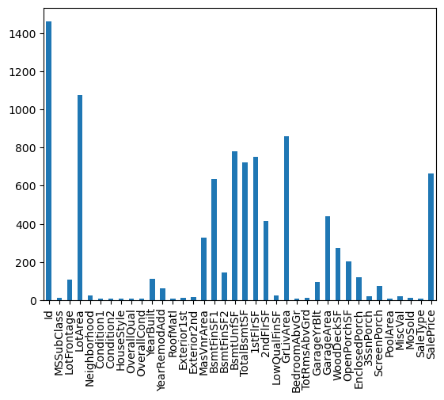
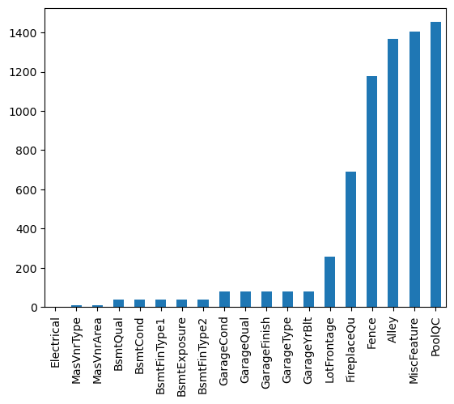

# House Price Prediction Model



This repository contains code and data for training a machine learning model to predict house prices. The model is built using Python and several popular data science libraries.

## Project Overview

The goal of this project is to develop a predictive model that can estimate the price of a house based on various features such as the number of bedrooms, square footage, location, etc. We utilize a dataset that includes historical house prices and their attributes to train our model.

## Dataset

The dataset used in this project contains several features including but not limited to:
- Number of bedrooms
- Number of bathrooms
- Square footage
- Lot size
- Year built
- Location (zip code)

## Getting Started

To get started with this project, follow these steps:

1. **Clone the repository:**
   ```bash
   git clone https://github.com/yourusername/house-price-prediction.git
   cd house-price-prediction



